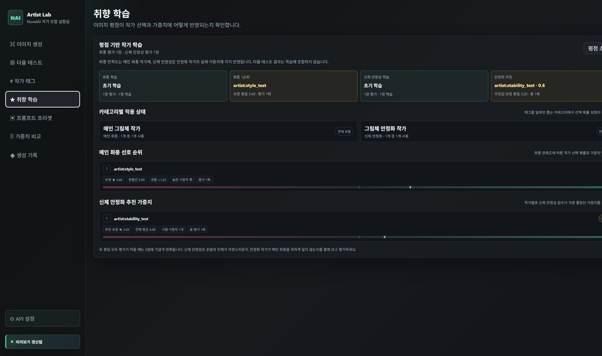

# NAI Artist Combination Lab

NovelAI에서 여러 작가 태그 조합을 시험해보고, 마음에 드는 그림체의 작가 가중치를 찾아내기 위한 앱입니다.

예를 들어 같은 캐릭터 프롬프트를 두고 작가 태그의 가중치만 바꿔 여러 장을 만든 뒤, 마음에 드는 이미지의 가중치를 다시 불러와 고정해서 더 테스트할 수 있습니다.

이미지에 `화풍 만족도`와 `신체 안정성` 평점을 남기면 앱이 메인 화풍 작가와 안정화 작가의 적절한 가중치를 따로 학습합니다. 자주 함께 쓰는 베이스와 캐릭터 프리셋은 하나의 세트로 묶어 한 번에 선택할 수 있습니다.

## 이런 분에게 좋습니다

- NovelAI에서 그림체 조합을 여러 번 실험하는 분
- `artist:*` 태그의 가중치를 매번 손으로 바꾸기 귀찮은 분
- 마음에 드는 이미지가 나왔을 때 그 작가 가중치를 저장해두고 싶은 분
- 여러 캐릭터/장면 프리셋에서 같은 그림체가 안정적으로 나오는지 보고 싶은 분

## 준비물

이 앱은 브라우저에서 열리지만, 실행을 위해 아래 두 가지가 필요합니다.

- Node.js 18 이상
- Python 3.10 이상

설치되어 있지 않다면 아래 공식 사이트에서 받을 수 있습니다.

- Node.js: https://nodejs.org/
- Python: https://www.python.org/downloads/

잘 모르겠다면 Node.js는 `LTS` 버전을 설치하면 됩니다.

설치되어 있는지 확인하려면 터미널에서 아래 명령어를 입력합니다.

```powershell
node -v
python --version
```

버전 숫자가 나오면 준비된 상태입니다.

## 실행하기

Windows에서는 시작 메뉴에서 `PowerShell`을 열고 아래 명령어를 입력합니다.

```powershell
npx nai-aclab
```

macOS에서는 `터미널`을 열고 같은 명령어를 입력하면 됩니다.

처음 실행할 때는 npm이 패키지를 내려받겠냐고 물어볼 수 있습니다. `y`를 입력하고 Enter를 누르면 됩니다.

실행되면 브라우저가 자동으로 열립니다. 앱을 사용하는 동안 터미널 창은 닫지 마세요. 앱을 종료하려면 터미널에서 `Ctrl+C`를 누르거나 터미널 창을 닫으면 됩니다.

자주 사용할 경우 전역 설치도 가능합니다.

```powershell
npm install -g nai-aclab
nai-aclab
```

## 처음 설정하기

처음 켜면 아래 순서대로 설정하면 됩니다.

1. `API 설정` 메뉴로 이동합니다.
2. NovelAI API 토큰을 입력합니다.
3. `API 없이 체험하기`를 끕니다.
4. `설정 저장`을 누릅니다.

API 토큰을 아직 넣고 싶지 않다면 `API 없이 체험하기`를 켜둔 채로 UI만 먼저 테스트할 수 있습니다. 체험 모드에서는 실제 NovelAI API를 쓰지 않고 테스트용 이미지를 만듭니다.

대부분의 사용자는 `Endpoint`, `Model`, `Sampler`, `Noise Schedule` 같은 값은 기본값 그대로 두면 됩니다. 처음 설치하면 이미지 모델은 `NAI Diffusion V5 Full`로 설정됩니다.


왼쪽 아래의 `NAI V5 할당량` 패널에서는 현재 V5 사용 한도와 Image Anlas를 확인할 수 있습니다. 약 1분마다 자동으로 갱신되며, `↻` 버튼을 누르면 바로 새로고침됩니다. API 토큰을 바꾸거나 이미지 생성이 끝난 뒤에도 자동으로 최신 정보가 반영됩니다.

## 기본 사용 순서

### 1. 작가 태그 등록

`작가 태그` 메뉴에서 사용할 작가 태그를 넣습니다.

작가 태그는 한 줄씩 넣어도 됩니다.

```text
artist:example_main
artist:sample_a
```

기존에 쓰던 프롬프트 조각을 그대로 붙여넣어도 됩니다.

```text
1.3::artist:example_alpha ::, 1.1::artist:example_beta ::, 0.8::artist:example_gamma ::,
```

앱은 여기서 `artist:*` 부분만 자동으로 찾아냅니다.

`한 번에 사용할 태그 수`를 비워두면 그 카테고리에 적은 작가 태그를 모두 사용합니다. 일부만 랜덤으로 뽑고 싶을 때만 숫자를 입력하면 됩니다.

아래의 `인식된 artist 태그`에 원하는 태그가 제대로 표시되는지만 확인하면 됩니다. 저장은 입력과 동시에 자동으로 처리됩니다.


### 평점으로 취향 학습시키기

이미지를 여러 장 만든 뒤 생성 화면의 실시간 미리보기에서 두 가지 1~5점 평점을 남길 수 있습니다. 히스토리와 가중치 비교에서 이미지를 클릭해 평가해도 됩니다.

| 평점 항목 | 평가 기준 | 다음 생성에서의 변화 |
| --- | --- | --- |
| 화풍 만족도 | 완성된 그림체가 내 취향에 맞는지 | 메인 화풍 작가의 포함 확률과 가중치 방향을 조정합니다. |
| 신체 안정성 | 인체·손발이 자연스럽고 안정화 작가가 메인 화풍을 과하게 덮지 않는지 | 안정화 작가마다 좋은 결과를 낸 가중치를 더 자주 선택합니다. |

4~5점은 좋은 결과, 3점은 중립, 1~2점은 좋지 않은 결과로 해석합니다. 평가가 한두 장뿐일 때는 우연한 결과에 지나치게 끌려가지 않도록 점수를 3점에 가깝게 완화합니다.

알아둘 점:

- `메인 화풍` 역할의 카테고리에는 화풍 만족도만 반영됩니다.
- `신체 안정화` 역할의 카테고리에는 신체 안정성만 반영됩니다.
- 안정화 학습은 작가 이름만 보지 않고 `작가 + 실제 가중치` 조합별로 점수를 모읍니다.
- 아직 평가가 적은 가중치도 가끔 다시 사용하여 더 좋은 값을 놓치지 않도록 합니다.
- `한 번에 사용할 태그 수`를 비워두면 모든 작가를 사용하므로 포함 확률보다 가중치 선택에 학습 결과가 더 많이 반영됩니다.
- 타율 테스트는 이미 불러온 작가 조합을 고정해 여러 씬에서 검증하는 기능이므로 평점을 받지 않으며 학습에도 포함되지 않습니다.
- 학습 내용을 지우고 처음부터 다시 시작하려면 `취향 학습` 메뉴에서 `평점 초기화`를 누르세요.

`취향 학습` 메뉴에서는 메인 화풍 선호 순위와 안정화 작가별 추천 가중치를 따로 확인할 수 있습니다. 작가별 `포함 ×1.20`은 중립 작가보다 선택 가중치가 약 20% 높다는 뜻입니다. 안정화 작가에는 지금까지 시험한 가중치 수, 추천 가중치와 보정 점수가 표시됩니다.

기존 버전에서 남긴 단일 평점은 업데이트 후 `화풍 만족도`로 자동 이전됩니다. 신체 안정성은 업데이트 이후 생성한 결과부터 별도로 평가하면 됩니다.

NAI V5에서는 작가 태그 순서도 결과에 영향을 줄 수 있어, 랜덤 모드에서는 높은 가중치의 태그를 프롬프트 앞과 뒤에 번갈아 배치합니다. 가장 높은 태그가 앞에 올지 뒤에 올지는 생성할 때마다 무작위로 정합니다. 이미지에서 `가중치 불러오기`를 누르면 가중치뿐 아니라 그 이미지의 작가 태그 순서도 함께 고정됩니다.



### 2. 프리셋 만들기

`프리셋` 메뉴에서 자주 쓸 프롬프트를 저장합니다.

- 베이스 프롬프트: 배경, 구도, 상황 같은 전체 설명
- 퀄리티 프롬프트: 품질 관련 태그
- 캐릭터 프롬프트: 캐릭터별 외형과 행동
- 네거티브 프롬프트: 피하고 싶은 요소

공통 네거티브 프롬프트는 NovelAI의 UC에도 같은 내용으로 자동 전송됩니다.

최종 프롬프트는 아래 순서로 조립됩니다.

```text
베이스 프롬프트, 작가 태그, 퀄리티 프롬프트 | 캐릭터 1 | 캐릭터 2 | 캐릭터 3
```

NovelAI V4+의 멀티 캐릭터 프롬프트는 캐릭터를 쉼표로 합치지 않고 `|`로 나눕니다.

자주 함께 쓰는 `베이스 + 퀄리티`와 `캐릭터` 프리셋은 아래의 `프리셋 세트`에서 하나로 묶을 수 있습니다. 두 프리셋의 이름이 같으면 별도 설정 없이 자동 세트가 만들어집니다. 이후 생성이나 타율 테스트에서 세트 하나만 고르면 두 프리셋이 함께 선택됩니다.


### 3. 이미지 생성

`생성` 메뉴에서 사용할 프리셋과 이미지 크기를 고른 뒤 `이미지 생성`을 누릅니다.

생성 중에는 `실시간 이미지 미리보기`에서 결과를 바로 확인할 수 있습니다. 생성이 끝난 이미지 카드에는 화풍과 신체 별점이 각각 나타나므로 메뉴를 이동하지 않고 바로 평가할 수 있습니다.

마음에 드는 이미지가 나오면 히스토리나 가중치 비교 화면에서 `가중치 불러오기`를 누릅니다. 그러면 해당 이미지에 쓰인 작가 가중치가 생성 메뉴에 고정됩니다.

고정된 가중치를 해제하고 싶으면 생성 메뉴에서 `고정 해제`를 누르면 됩니다.


## 주요 메뉴 설명

### 생성

이미지를 만드는 기본 화면입니다.

- 사용할 베이스+퀄리티 프리셋 선택
- 사용할 캐릭터 프리셋 선택
- 생성할 이미지 개수 선택
- 이미지 크기 선택
- 랜덤 가중치/고정 가중치 상태 확인
- 실시간 이미지 미리보기 확인

### 작가 태그

작가 태그 목록과 가중치 범위를 관리합니다.

기본 카테고리는 두 개입니다.

- 메인 그림체 작가: `메인 화풍` 학습 역할
- 그림체 안정화 작가: `신체 안정화` 학습 역할

필요하면 직접 카테고리를 추가할 수 있습니다. 새 카테고리를 만들 때 `학습 역할`에서 어떤 평점을 사용할지 선택하세요.

이 화면은 태그 입력, 인식 결과, 사용할 태그 수와 가중치 범위를 설정하는 데 사용합니다. 평점 결과와 학습 상태는 별도의 `취향 학습` 메뉴에서 확인합니다.

### 취향 학습

이미지 생성 결과에 남긴 평점이 다음 랜덤 생성에 어떻게 반영되는지 확인하는 화면입니다.

- 화풍 만족도와 신체 안정성의 평가 이미지 수
- 메인 화풍 작가 선호 순위와 포함 배율
- 안정화 작가별 추천 가중치와 시험한 가중치 수
- 카테고리별 학습 역할과 선택 확률 보정 여부
- 모든 평점과 학습 결과 초기화

### 프리셋

반복해서 쓸 프롬프트를 저장하는 곳입니다.

프리셋을 잘 만들어두면 매번 긴 프롬프트를 다시 입력하지 않아도 됩니다.

### 히스토리

생성한 이미지를 모아보는 곳입니다.

- 이미지 크게 보기
- 좌우 방향키로 이미지 이동
- 마우스 휠로 확대/축소
- 드래그로 확대된 이미지 이동
- 마음에 드는 이미지의 가중치 불러오기
- 이미지에 화풍 만족도와 신체 안정성 평점 남기기
- 히스토리 선택 삭제 또는 전체 삭제
- 이상형 월드컵 실행


### 가중치 비교

한 히스토리 안에서 생성된 이미지들을 옆으로 훑어보며, 각 이미지에 어떤 작가 가중치가 쓰였는지 비교하는 화면입니다.

여기서도 마음에 드는 이미지의 `가중치 불러오기`를 누를 수 있습니다.


### 이상형 월드컵

히스토리 이미지 중에서 두 장씩 비교하며 가장 마음에 드는 이미지를 고르는 기능입니다.

우승/준우승 이미지에서도 바로 `가중치 불러오기`를 할 수 있습니다.

### 타율 테스트

마음에 드는 작가 가중치를 고정한 상태로 여러 프리셋 조합을 한 번에 테스트하는 기능입니다.

여기서 `씬`은 아래 조합을 뜻합니다.

```text
씬 = 베이스+퀄리티 프리셋 + 캐릭터 프리셋 + 이미지 해상도 + 생성 개수
```

사용 순서:

1. 히스토리나 가중치 비교에서 마음에 드는 이미지의 `가중치 불러오기`를 누릅니다.
2. `타율 테스트` 메뉴로 이동합니다.
3. `씬 추가`를 눌러 테스트할 조합을 등록합니다.
4. 필요한 만큼 씬을 추가합니다.
5. `타율 테스트 시작`을 누릅니다.

생성 중 멈추고 싶으면 `생성 중지`를 누르면 됩니다. 현재 처리 중인 이미지가 끝난 뒤 남은 생성을 멈춥니다.

타율 테스트 화면에서는 실시간 미리보기와 전체 진행 상태가 가장 먼저 표시됩니다. 작가 가중치와 순서는 모든 씬에서 그대로 유지되며, 타율 테스트 결과는 취향 학습 평점에서 제외됩니다.


## 이미지 크기

생성 메뉴에서 아래 크기 중 하나를 고를 수 있습니다.

- Normal Portrait: 832 x 1216
- Landscape: 1216 x 832
- Square: 1024 x 1024

## 저장되는 정보

앱 설정과 생성 이미지는 내 컴퓨터에 저장됩니다.

기본적으로 홈 폴더 아래에 `nai_aclab` 폴더를 만들고, 그 안에 설정과 생성 이미지를 함께 저장합니다.

- Windows: `C:\Users\사용자이름\nai_aclab`
- macOS: `~/nai_aclab`
- Linux: `~/nai_aclab`

폴더 안의 구조는 아래처럼 나뉩니다.

- `data`: 앱 설정과 API 토큰 secret 파일
- `outputs`: 생성된 이미지

API 토큰은 일반 설정 파일에 저장하지 않고 별도 secret store에 저장합니다. 앱 화면으로 다시 내려보내지도 않습니다.

생성 히스토리에는 이미지 표시와 작가 가중치 비교에 필요한 최소 정보만 저장합니다. 최종 프롬프트, 네거티브 프롬프트, 생성 요청 JSON, 로컬 절대 경로는 별도로 저장하지 않습니다.

NovelAI가 이미지 파일 안에 저장하는 생성 정보는 그대로 남을 수 있습니다. 이 정보는 이미지 자체의 메타데이터입니다.

## 자주 묻는 문제

### `npx` 명령어가 안 됩니다

Node.js가 설치되어 있지 않거나 너무 오래된 버전일 수 있습니다. Node.js 18 이상을 설치한 뒤 다시 시도하세요.

### Python을 찾을 수 없다고 나옵니다

Python 3.10 이상이 설치되어 있는지 확인하세요.

Windows에서 Python을 설치할 때는 `Add Python to PATH` 옵션을 켜는 것이 좋습니다.

### 브라우저가 열렸는데 앱이 멈춘 것 같습니다

터미널 창을 닫으면 앱 서버도 종료됩니다. 앱을 사용하는 동안 터미널 창을 열어두세요.

### 이미지가 실제로 생성되지 않고 테스트 이미지만 나옵니다

`API 설정`에서 `API 없이 체험하기`가 켜져 있는지 확인하세요. 실제 NovelAI 생성을 하려면 체험 모드를 꺼야 합니다.

### 기본 endpoint가 아닌 주소라는 경고가 나옵니다

API 설정의 `Endpoint`가 기본 NovelAI 주소와 다를 때 나오는 경고입니다. API 토큰이 해당 주소로 전송될 수 있으므로, 직접 설정한 주소가 맞는지 확인한 뒤 계속하세요.
